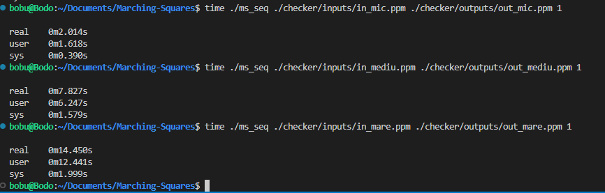

# Proiect APP

### Echipa: Prunescu Bogdan-Andrei, Dinuta Eduard-Stefan, Bogdan Valentin-Razvan (341C1) 

## Week 1

- Creare repo github si README
- Implementare cod serial:
    - Complexitate temporala: O(n^2)
    - Complexitate spatiala: O(n^2)
- Realizare teste de diferite dimensiuni si calcularea timpilor de executie:
    - test mic : 2s
    - test mediu : 7.8s
    - test mare: 14.4s

- Profiling folosind Vtune

