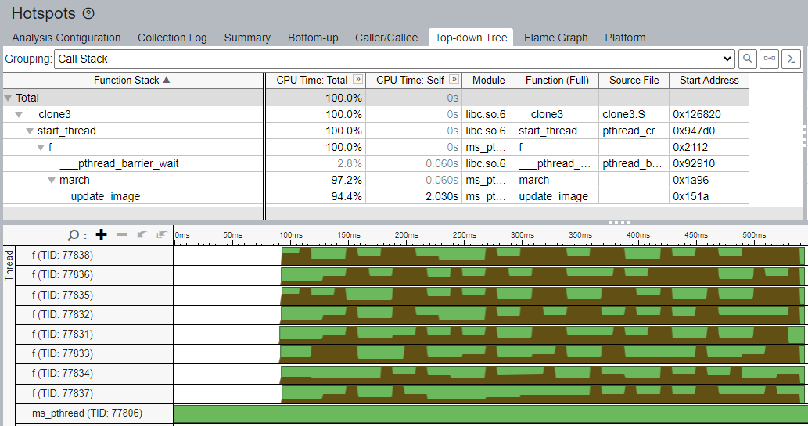

# Proiect APP

### Echipa: Prunescu Bogdan-Andrei, Dinuta Eduard-Stefan, Bogdan Valentin-Razvan (341C1) 

## Scurta descriere:

Marching Squares este un algoritm de grafica introdus in anii 1980 care poate fi folosit pentru delimitarea contururilor dintr-o imagine. El poate fi folosit pentru a desena linii de altitudine pe harti topografice, temperaturi pe harti termice, puncte de presiune pe harti de camp de presiune, etc.

## Exemplu
Programul construieste imagini care constituie conturul reliefului pentru diferite altitudini. Prima poza este inputului iar restul sunt calculate folosing sigma = 208, 136 si 61.
 
   
## Week 1

- Creare repo github si README
- Implementare cod serial:
    - Complexitate temporala: O(n^2)
    - Complexitate spatiala: O(n^2)
- Realizare teste de diferite dimensiuni si calcularea timpilor de executie:
    - test mic (2048x2048 pixeli) : 2.121s
    - test mediu (4096x4096 pixeli) : 7.631s
    - test mare: (8192x8192 pixeli) 16.292s
Specs:
- CPU: 11th Gen Intel(R) Core(TM) i7-11700KF @ 3.60GHz
- Thread(s) per core: 2
- Core(s) per socket: 8
- Socket(s): 1
- Caches (sum of all):      
    - L1d: 384 KiB (8 instances)
    - L1i: 256 KiB (8 instances)
    - L2: 4 MiB (8 instances)
    - L3: 16 MiB (1 instance)
- RAM: 16 GB

### Implementare secventiala

Profiling folosind Vtune:
- test mic:

- test mediu

- test mare

Variatie timp secvential dupa dimensiunea inputului:

## Week 2

### Implementare pthreads

Timpi de executie in functie de threaduri:

Profiling:

- Test mic (2048 x 2048):
    - 2 threaduri:

        

        
    
    Pentru 2 threaduri se observa ca cele 2 threaduri sunt folosite la maxim in cel mai mare procent din timp. 

    - 8 threaduri:

        

        

    Pentru ca testul este prea mic odata cu cresterea numarului de threaduri nu se observa o eficienta foarte buna utilizarii core-urilor.

    - 16 threaduri:

        

        

    Deja pentru 16 threaduri sunt folosite toate pentru foarte putin timp, folosing on average 8 threaduri.

- Test mediu (4096 x 4096):

    Testul mediu beneficiaza de o utilizare mai buna a threadurilor, dar 16 threaduri inca sunt prea mult pentru acest task, utilizandu-le complet aproape deloc.

    - 8 threaduri:

        

        

    - 16 threaduri:

        

        

- Test mare (8192 x 8192):

    Testul mare beneficiaza la maxim de paralelism si se observa si o o diferenta in timpul petrecut in functii. Un nou bottleneck este functia de rescale a imaginii.
    
    - 16 threaduri:
    
        

        
    
    Se poate vedea ca pentru 16 threaduri sunt folosite cea mai mult din timp 16 threaduri.

## Week 3

### Implementare openmp

Din timpii de executie se observa ca openmp este putin mai incet decat pthreads, din cauza apelarii de mai multe ori a directivelor pragma, pe cand la pthreads threadurile sunt create o singura data si folosite pana la terminarea programului.
In plus, am folosit directiva schedule cu parametrul auto, dar prin testarea cu diferiti parametrii, guided s-a dovedit a fi cea mai buna alegere.

Timpi de executie in functie de threaduri:

Profiling:

- Test mic (2048 x 2048):
    - 2 threaduri:

        

        

    - 8 threaduri:

        

        

    - 16 threaduri:

        

        

- Test mediu (4096 x 4096):

    - 8 threaduri:

        

        

    - 16 threaduri:

        

        

- Test mare (8192 x 8192):
    
    - 16 threaduri:
    
        

        